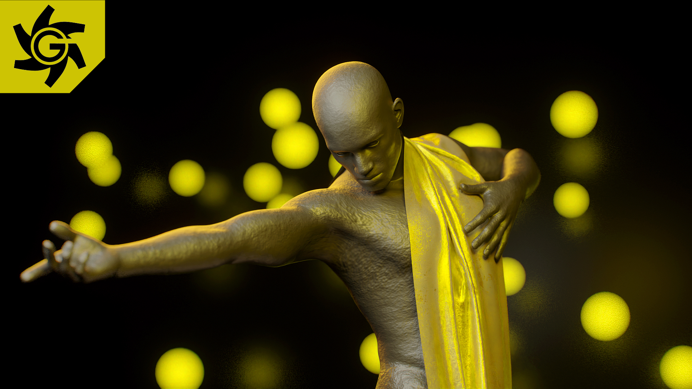

# OG (Octane Gaffer)

**Version:** 1.4.0
**Author:** TrevisCloud

**OG (Octane Gaffer)** is a professional lighting and cinematography toolkit for Blender artists working with OctaneRender. The add-on bridges the gap between traditional studio photography techniques and 3D rendering workflows.

---

## 🎉 Latest Release: v1.4.0

**New in this version**:

- **Backdrop Preview**: Visual preview of the backdrop before adding it to the scene.
- **Cross-Platform Support**: Fully tested and compatible with Windows and macOS.

## ✨ Features

### 🎬 Lighting Presets

- **Low Key**: Dramatic high-contrast lighting.
- **Butterfly**: Beauty/portrait lighting.
- **Side/Split**: Directional split lighting.

### 🎛️ Real-Time Light Control

- Adjust **Power**, **Distance**, **Height**, and **Softness** with live updates.
- **Group Rotation**: Rotate entire lighting rig around target.
- RGB color picker and per-light camera visibility.

### 📸 Camera System

- **Cinema Camera Presets**: ARRI, RED, Sony, Canon, Blackmagic.
- **Real Sensor Formats**: Super 35, Fullframe, Alexa 65, IMAX.
- **Depth of Field**: f-stop controls matched to real lens hardware.
- **Autofocus**: Raycast autofocus to focus on any surface.

### 🌫️ Atmosphere & Effects

- **Octane Scatter Medium**: Professional fog/volumetric atmosphere.
- **Bokeh Generator**: Create randomized background lights with customizable parameters.

### 🎨 Environment Tools

- **Backdrop System**: Curved studio backdrop with visual preview.
- **Cleanup**: One-click removal of all addon objects.

---

## 🚀 Installation

### 1. Download

Download the latest release zip file:
👉 **[og-octane-gaffer.zip](./og-octane-gaffer.zip)**

### 2. Install in Blender

1. Open **Blender** (4.5.2+).
2. Go to `Edit` → `Preferences` → `Add-ons`.
3. Click **Install** (top right).
4. Select the downloaded `og-octane-gaffer.zip` file.
5. **Enable** the addon by checking the box next to "OG for Octane Gaffer".

> **Note**: This addon is specifically designed for **OctaneRender** and will not work with Cycles or Eevee.

---

## 📋 Requirements

| Software                     | Minimum Version |
| ---------------------------- | --------------- |
| **Blender**                  | 4.5.2+          |
| **OctaneRender for Blender** | 30.7.0+         |

---

## 📜 License

This project is licensed under **GNU General Public License v3.0 with Non-Commercial Addendum**.

- ✅ **Free to use** for personal and non-commercial projects.
- ✅ **Open source** - modify and share freely.
- ❌ **Cannot be sold** or used in commercial products.

See [LICENSE](./LICENSE) for full terms.

---

## 📞 Support & Contact

- 🐛 **Bug Reports**: [GitHub Issues](../../issues)
- 💬 **Discussions**: [GitHub Discussions](../../discussions)
- 💼 **LinkedIn**: [www.linkedin.com/in/trevisacloud](https://www.linkedin.com/in/trevisacloud)
- 🐙 **GitHub**: [github.com/TrevisCloud](https://github.com/TrevisCloud)
